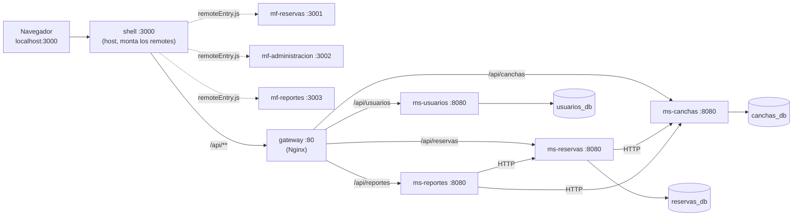

# Sistema de Reserva de Canchas Deportivas

Sistema web para reservar canchas de pádel, tenis y básquet en bloques horarios de una hora, con
gestión del catálogo, bloqueos de mantenimiento y reportes de ocupación para el administrador.

Backend en Java 21 con Spring Boot 3.5.3, repartido en cuatro microservicios sobre PostgreSQL 16;
frontend en React 18 con Webpack 5 y Module Federation, repartido en un host y tres remotes;
un gateway Nginx como punto de entrada único al tráfico `/api`. Todo se ejecuta con Docker Compose.

---

## 1. Arquitectura

### Microservicios

| Servicio | Responsabilidad | Base de datos | Puerto |
|---|---|---|---|
| `ms-usuarios` | Registro, inicio de sesión y emisión del JWT; listado de usuarios y cambio de su estado (`ADMIN`) | `usuarios_db` | 8082 |
| `ms-canchas` | Catálogo de canchas —alta, edición, estado, horario de atención— y bloqueos de mantenimiento | `canchas_db` | 8083 |
| `ms-reservas` | Disponibilidad por cancha y fecha, creación de reservas, historial y cancelación | `reservas_db` | 8084 |
| `ms-reportes` | Ocupación por cancha, reservas y cancelaciones por período (solo `ADMIN`) | **ninguna**: consume `ms-canchas` y `ms-reservas` por HTTP | 8085 |

Cada microservicio tiene su propia base y su propio usuario de PostgreSQL. **Ninguno lee tablas de
otro**: la integración entre ellos es siempre REST.

### Microfrontends

| Microfrontend | Contenido | Tipo | Puerto |
|---|---|---|---|
| `shell` | Inicio de sesión, registro, menú y sesión; monta los tres remotes | host | 3000 |
| `mf-reservas` | Consulta de disponibilidad, nueva reserva y "mis reservas" | remote (`mfReservas`) | 3001 |
| `mf-administracion` | Gestión de canchas, bloqueos, reservas de todos los usuarios y usuarios | remote (`mfAdministracion`) | 3002 |
| `mf-reportes` | Ocupación, reservas y cancelaciones por período (solo `ADMIN`) | remote (`mfReportes`) | 3003 |

El navegador entra por el `shell` (`http://localhost:3000`) y descarga el `remoteEntry.js` de cada
remote de su propio puerto. Los estáticos **no** pasan por el gateway; el tráfico `/api`, sí.

### Flujo de una petición



Los tres remotes hacen sus llamadas con rutas relativas bajo `/api`, así que montados en el shell
salen por el mismo camino. `ms-reportes` no tiene base: arma sus reportes consultando por HTTP a
`ms-canchas` y `ms-reservas`.

---

## 2. Requisitos previos

Solo dos cosas:

- **Docker Desktop** con **Docker Compose v2** (`docker compose`, sin guion).
- **Git**, para clonar el repositorio.

**No hace falta instalar Java, Maven, Node, npm ni psql.** Todo se compila y se ejecuta dentro de
contenedores: los cuatro microservicios se construyen con una imagen `maven:3.9-eclipse-temurin-21`
dentro de su propio `Dockerfile`, los cuatro microfrontends corren `npm install` y `webpack serve`
dentro de un contenedor `node:20-alpine` con el código montado por volumen, y a PostgreSQL se
llega con `docker compose exec postgres psql`. Quien clone el repositorio no necesita ninguna de
esas herramientas en su máquina.

---

## 3. Puertos que deben estar libres

`docker compose up -d` falla si cualquiera de estos puertos está ocupado en la máquina.

| Puerto | Servicio | Para qué se usa | ¿Lo usa la aplicación? |
|---|---|---|---|
| 3000 | `shell` | **URL por la que se entra al sistema** | **sí** |
| 3001 | `mf-reservas` | `remoteEntry.js` del remote, pedido por el navegador | **sí** |
| 3002 | `mf-administracion` | `remoteEntry.js` del remote | **sí** |
| 3003 | `mf-reportes` | `remoteEntry.js` del remote | **sí** |
| 8090 | `gateway` | verificación con `curl.exe` y demostración del punto de entrada único | no: los frontends lo llaman por la red interna de Docker |
| 8081 | `adminer` | cliente web de PostgreSQL, herramienta de desarrollo | no |
| 8082 | `ms-usuarios` | Swagger UI y pruebas con `curl.exe` | no |
| 8083 | `ms-canchas` | Swagger UI y pruebas con `curl.exe` | no |
| 8084 | `ms-reservas` | Swagger UI y pruebas con `curl.exe` | no |
| 8085 | `ms-reportes` | Swagger UI y pruebas con `curl.exe` | no |
| 5432 | `postgres` | acceso directo a la base con un cliente | no |

Los cuatro primeros son **de la aplicación**: cambiarlos obliga a tocar además la URL del remote en
el `webpack.config.js` del shell y el `client.webSocketURL` del microfrontend afectado. Los siete
restantes son **de servicio**: si uno está ocupado basta con cambiar su mapeo en
`docker-compose.yml` y la aplicación sigue funcionando igual.

**Antes de levantar, revisa los contenedores de otros proyectos.** Es la causa de fallo más
frecuente y el síntoma engaña: una aplicación ajena escuchando en el mismo puerto responde con su
propio formato de error y parece que fallara este sistema. Por eso el gateway usa `8090` y no el
`8080` habitual.

```powershell
docker ps -a
netstat -ano | Select-String ":3000|:3001|:3002|:3003|:8090|:8081|:808[2-5]|:5432"
```

---

## 4. Cómo levantar el sistema

Desde PowerShell, en la carpeta donde quieras clonar:

```powershell
git clone <url-del-repositorio> proyecto-canchas
cd proyecto-canchas
Copy-Item .env.example .env
docker compose up -d --build
```

`.env` define `POSTGRES_USER`, `POSTGRES_PASSWORD`, `JWT_SECRET` y `RESERVAS_MAX_ACTIVAS` (límite
de reservas activas por usuario, 3 por omisión). Los valores de `.env.example` sirven tal cual para
desarrollo local.

La **primera** construcción es la lenta: descarga las imágenes base, compila los cuatro
microservicios con Maven dentro de sus imágenes —bajando todo el árbol de dependencias— y ejecuta
`npm install` en los cuatro microfrontends. Las siguientes reutilizan la caché de Docker y los
volúmenes de `node_modules`, y son mucho más rápidas. Mientras tanto, `docker compose ps` muestra
los servicios que ya están arriba:

```powershell
docker compose ps
```

Los once servicios —`postgres`, los cuatro `ms-*`, `gateway`, `adminer` y los cuatro frontends—
deben quedar en `Up`, y `postgres` además en `(healthy)`.

Al arrancar el contenedor `gateway` aparece esta línea, que **no es un error**:

```
10-listen-on-ipv6-by-default.sh: info: can not modify /etc/nginx/conf.d/default.conf (read-only file system?)
```

Es el entrypoint de la imagen de Nginx intentando escribir en el archivo de configuración, que está
montado de solo lectura a propósito. Nginx escucha igual en IPv4 e IPv6.

---

## 5. Cómo verificar que funciona

**La aplicación** se abre en:

```
http://localhost:3000
```

**Comprobaciones desde la línea de comandos** (PowerShell; usa `curl.exe`, no `curl`):

```powershell
# 1. Los frontends responden
curl.exe -s -o NUL -w "%{http_code}`n" http://localhost:3000
curl.exe -s -o NUL -w "%{http_code}`n" http://localhost:3001/remoteEntry.js

# 2. El gateway enruta hacia los microservicios: sin token responde 401 del microservicio
curl.exe -i http://localhost:8090/api/canchas

# 3. Inicio de sesion, que devuelve el token
curl.exe -i -X POST http://localhost:8090/api/usuarios/sesiones -H "Content-Type: application/json" -d "{\"email\":\"admin@canchas.ec\",\"password\":\"Admin123\"}"

# 4. Una consulta con el token del paso anterior
curl.exe -s http://localhost:8090/api/canchas -H "Authorization: Bearer <token>"

# 5. Lo que no es /api no lo atiende el gateway: responde 404
curl.exe -i http://localhost:8090/
```

Los pasos 2 y 3 confirman la cadena completa: gateway → microservicio → base de datos.

Si algo no responde, el primer sitio donde mirar es el registro del servicio:

```powershell
docker compose logs --tail=50 gateway
docker compose logs --tail=50 ms-usuarios
docker compose logs --timestamps --tail=50 shell
```

Para los cuatro microfrontends, **usa siempre `--timestamps`**: `webpack serve` no limpia su
registro entre reinicios y un `compiled successfully` antiguo se lee como una compilación nueva.

---

## 6. Credenciales de prueba

Las carga `infra/postgres/05-seed.sql` al crear la base:

| Correo | Contraseña | Rol |
|---|---|---|
| `admin@canchas.ec` | `Admin123` | `ADMIN` |
| `usuario@canchas.ec` | `Usuario123` | `USUARIO` |

En la base no se guarda la contraseña sino su **hash BCrypt** de coste 10. El `ADMIN` ve los tres
módulos —Reservas, Administración y Reportes—; el `USUARIO`, solo Reservas.

---

## 7. Estructura del repositorio

```
backend/            Los cuatro microservicios Spring Boot, uno por carpeta, cada uno con su Dockerfile
frontend/           El shell y los tres remotes, cada uno con su webpack.config.js y su package.json
infra/postgres/     DDL versionado y datos semilla; se ejecutan al crear la base
infra/nginx/        gateway.conf, la configuracion del gateway y el unico lugar donde vive el enrutado
docs/               Contratos congelados, bitacora del proyecto, documento de alcance y capturas
.claude/specs/      Las diez especificaciones: requisitos, diseno y tareas de cada funcionalidad
docker-compose.yml  Los once servicios del sistema
CLAUDE.md           Reglas del proyecto: stack, convenciones y flujo de trabajo
.env.example        Plantilla de variables de entorno
```

---

## 8. Documentación del proyecto

- [`docs/contratos/README.md`](docs/contratos/README.md) — **contratos congelados**: campos, rutas
  REST, payloads, formato de error y contrato de Module Federation. Es la fuente única de verdad de
  la integración.
- [`docs/contratos/canchas-postman-collection.json`](docs/contratos/canchas-postman-collection.json)
  — **colección de Postman** con las peticiones de la API; se importa desde Postman con
  *Import > File*.
- [`docs/bitacora.md`](docs/bitacora.md) — bitácora: qué se pidió en cada compuerta de cada spec,
  qué se corrigió y qué hallazgos aparecieron.
- [`.claude/specs/`](.claude/specs/) — una carpeta por funcionalidad, con `requirements.md`,
  `design.md` y `tasks.md`.
- [`CLAUDE.md`](CLAUDE.md) — reglas de trabajo, stack fijado y convenciones de código.

**Documentación OpenAPI**, con el sistema levantado:

| Microservicio | Swagger UI |
|---|---|
| `ms-usuarios` | http://localhost:8082/swagger-ui/index.html |
| `ms-canchas` | http://localhost:8083/swagger-ui/index.html |
| `ms-reservas` | http://localhost:8084/swagger-ui/index.html |
| `ms-reportes` | http://localhost:8085/swagger-ui/index.html |

Swagger vive fuera de `/api`, así que **no se llega por el gateway**: se abre en el puerto de cada
microservicio. La base se puede inspeccionar con Adminer en http://localhost:8081.

---

## 9. Cómo detener y limpiar

```powershell
# Detener los contenedores, conservando los datos
docker compose down

# Detener y borrar tambien los volumenes: base de datos y node_modules
docker compose down -v
```

**Advertencia sobre `-v`.** Los scripts de `infra/postgres/` —creación de usuarios y bases, los
tres DDL y el seed— solo se ejecutan cuando el volumen de datos está **vacío**, es decir, la
primera vez que arranca PostgreSQL. Con `docker compose down` normal, los datos sobreviven y esos
scripts **no** vuelven a correr: si modificas un DDL o el seed, el cambio no se aplica hasta que
borres el volumen con `down -v` y levantes de nuevo. Al revés, `down -v` borra todas las reservas y
canchas creadas durante las pruebas y deja solo los datos del seed.

---

## 10. Notas de desarrollo

- **El contrato es la fuente única de verdad.** Los nombres de campo JSON, las rutas y los códigos
  de error están congelados en `docs/contratos/README.md`. No se renombran, no se abrevian y no se
  traducen; añadir un campo o una ruta es un cambio de contrato, con su fila en el registro de
  cambios de ese archivo.
- **`spring.jpa.hibernate.ddl-auto=validate`.** Hibernate no crea ni modifica tablas: el esquema lo
  manda el DDL versionado de `infra/postgres/`. Si una entidad no cuadra con el DDL, el
  microservicio no arranca, y lo que se corrige es la entidad.
- **Ningún microservicio consulta tablas de otro.** Cada uno tiene su base y su usuario, y la
  integración entre servicios es REST: `ms-reservas` llama a `ms-canchas`, y `ms-reportes` llama a
  los dos por HTTP porque no tiene base propia.
- **Todo el tráfico `/api` de la aplicación pasa por el gateway.** Ningún microfrontend conoce la
  dirección de un microservicio: el reparto por dominio vive solo en `infra/nginx/gateway.conf`.
  Las llamadas del frontend usan siempre rutas relativas bajo `/api`.
- **Versiones fijas.** Spring Boot **3.5.3** con Java 21 en los cuatro microservicios —con
  `springdoc-openapi` 2.8.6 y `jjwt` 0.12.6—, y React **18.3.1** con Webpack 5 en los cuatro
  microfrontends, compartido como `singleton` entre el host y los remotes. Cambiarlas es una
  decisión de proyecto, no de un módulo: se cambia primero en `CLAUDE.md`.
- **Sin Lombok, sin MapStruct, sin TypeScript y sin librerías de UI.** Mappers manuales, inyección
  por constructor y CSS plano.
