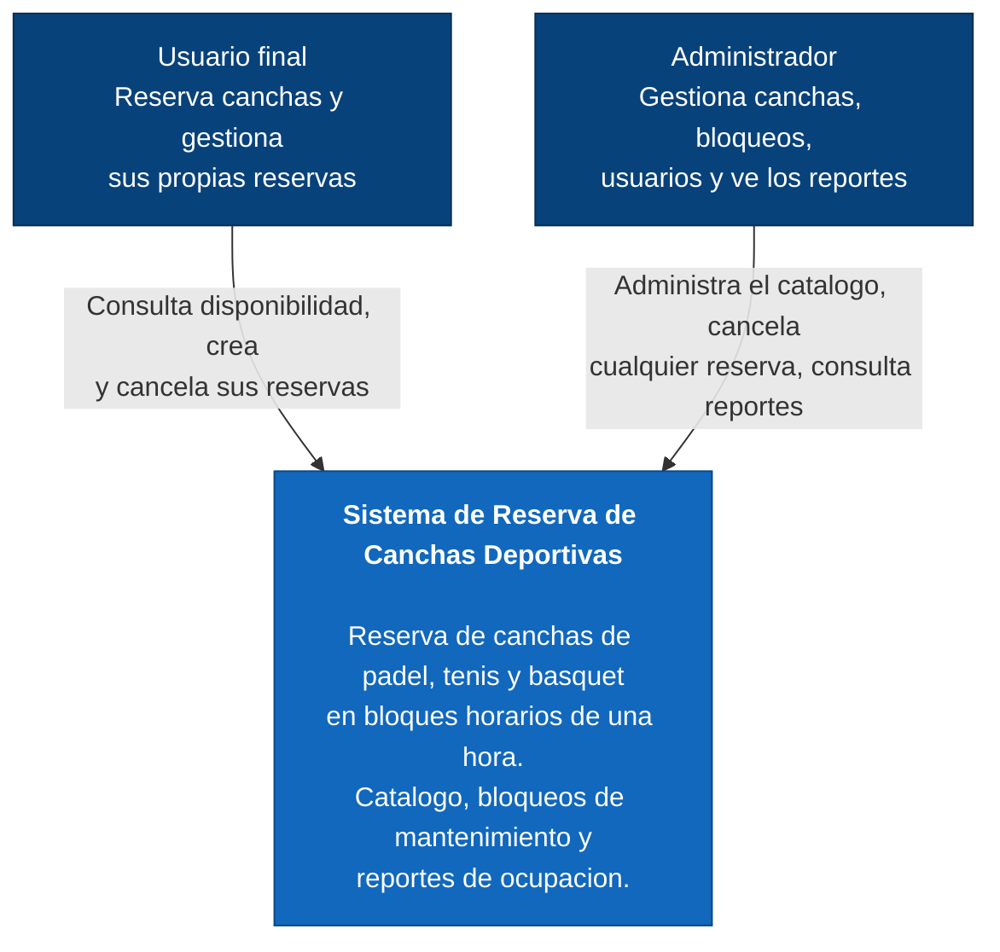
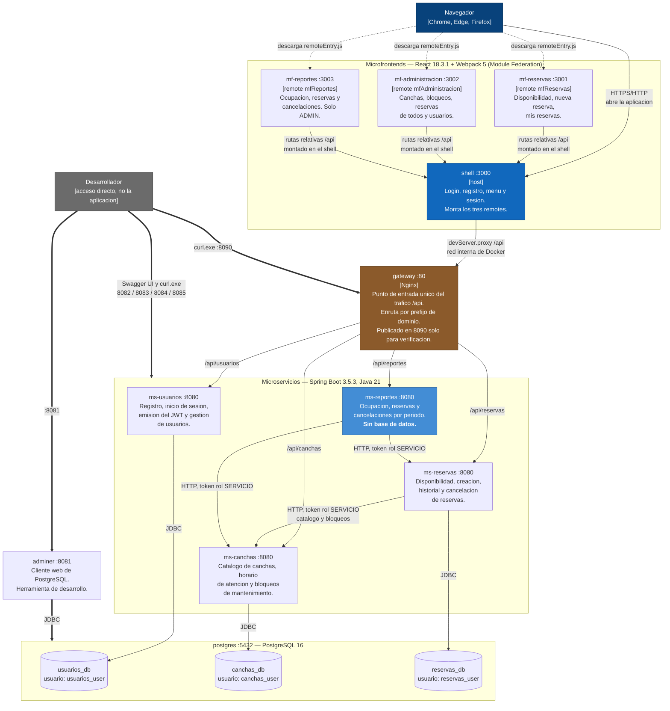
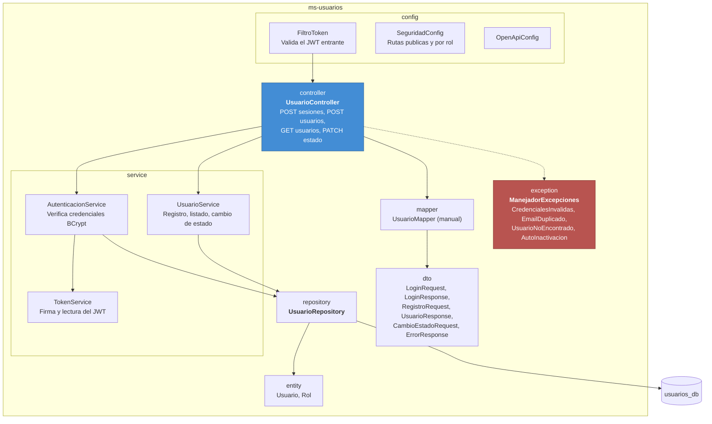
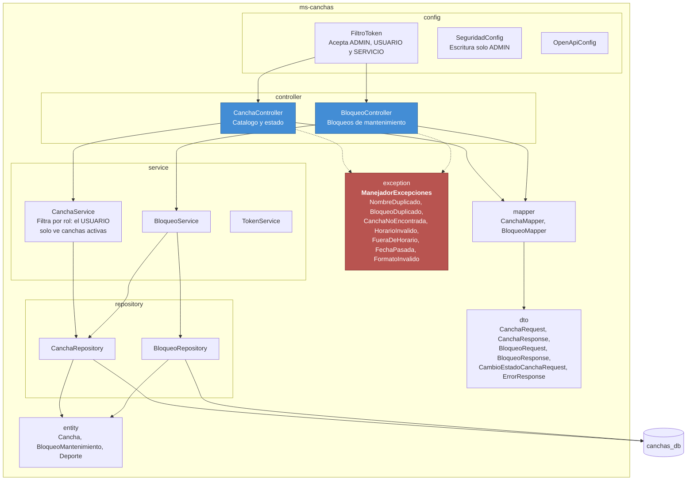
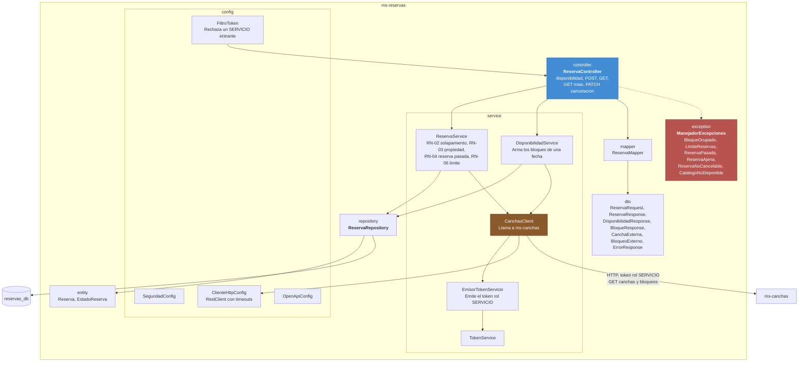
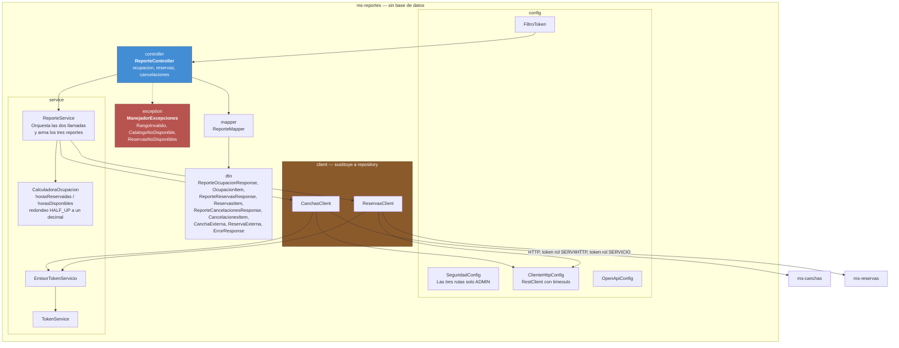
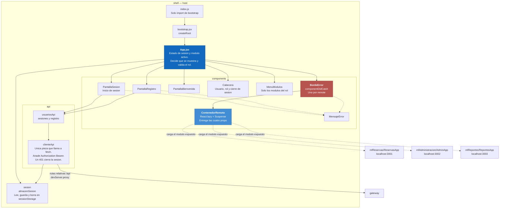
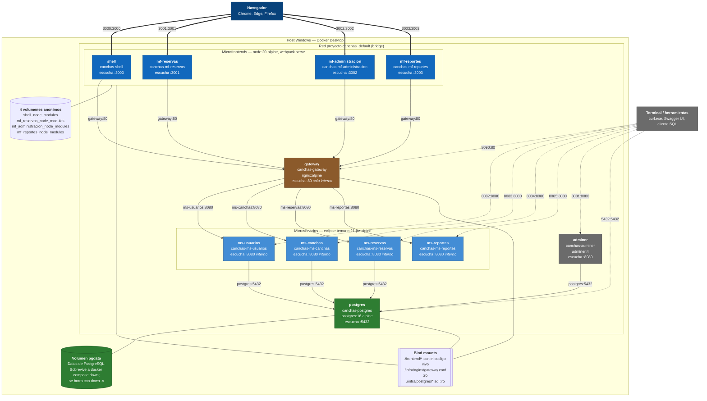

# Diagramas C4 — Sistema de Reserva de Canchas Deportivas

Tres niveles del modelo C4: **contexto**, **contenedores** y **componentes**. El nivel 4 —código—
no se incluye: lo cubre la sección de estructura de cada `design.md` en `.claude/specs/`, que ya
lista clase por clase.

Todo lo que aparece aquí sale de `docker-compose.yml`, `docs/contratos/README.md`, `CLAUDE.md` §3
y §4, los `design.md` de las specs 04, 06 y 10, y el árbol de clases y archivos del repositorio.
No hay ningún componente ni relación inventados.

## Nota sobre la notación

Los diagramas usan **`flowchart` con subgrafos**, no la sintaxis `C4Context` / `C4Container` /
`C4Component` de Mermaid. Dos motivos:

1. **`flowchart` renderiza en cualquier visor y en cualquier versión de Mermaid.** Las directivas
   C4 dependen de soporte específico, y este documento tiene que verse igual en GitHub, en el
   editor de quien lo lea y en el informe.
2. Esa sintaxis no permite distinguir **tipos de relación** con trazos distintos, y en este sistema
   esa distinción es justamente lo que más se malinterpreta: la descarga de los `remoteEntry.js`
   por el navegador no es lo mismo que una llamada a la API, y el acceso de desarrollo por los
   puertos `8082`–`8085` no es lo mismo que el camino de la aplicación.

La convención de trazos es la misma en los tres niveles:

- **línea continua** — camino de la aplicación en ejecución.
- **línea punteada** — descarga de estáticos por el navegador.
- **línea gruesa** — acceso de desarrollo, no usado por la aplicación.

Dentro de los diagramas el texto va **sin tildes**, para que ningún visor de Mermaid falle al
renderizar. El texto explicativo fuera de los bloques sí las lleva.

---

## Nivel 1 — Contexto

Dos actores y una sola caja. El `USUARIO` consulta disponibilidad, crea reservas y cancela **las
suyas**; el `ADMIN` gestiona el catálogo de canchas y sus horarios, los bloqueos de mantenimiento y
los usuarios, cancela **cualquier** reserva y es el único que ve los reportes.

**No hay ningún sistema externo, y es deliberado.** `CLAUDE.md` §2 deja fuera de alcance de forma
explícita la pasarela de pagos, las notificaciones por correo, SMS o push, las reservas
recurrentes, los torneos y la app móvil nativa. El sistema no integra con nada fuera de sí mismo:
no hay proveedor de identidad externo, ni servicio de correo, ni API de terceros.

---

## Nivel 2 — Contenedores

Los once servicios del `docker-compose.yml`. Las cinco relaciones que más se malinterpretan quedan
separadas a propósito:

- **El navegador descarga los `remoteEntry.js` directamente de `3001`, `3002` y `3003`** (líneas
  punteadas). Los estáticos de los remotes no pasan por el gateway.
- **Las llamadas a la API de los remotes van al shell, no a sus propios puertos.** Un remote
  montado en el shell hace `fetch("/api/...")` con ruta relativa, y el navegador la resuelve contra
  el origen del shell (`localhost:3000`). El `devServer.proxy` de cada remote solo interviene si
  alguien lo abre suelto en su puerto.
- **El shell proxya `/api` al gateway por la red interna de Docker** (`http://gateway:80`), no por
  un puerto del host.
- **`ms-reportes` no tiene base de datos.** Arma sus tres reportes consultando por HTTP a
  `ms-canchas` y `ms-reservas`.
- **No hay ni una flecha de un microservicio a la base de otro.** Cada base tiene su propio usuario
  de PostgreSQL, y la integración entre servicios es siempre REST (`CLAUDE.md` §3).

Las líneas gruesas son **acceso de desarrollo**: Swagger UI y `curl.exe` por los puertos
`8082`–`8085`, el `8090` del gateway y Adminer en `8081`. La aplicación no usa ninguno de ellos;
existen para documentación, verificación y demostración.

---

## Nivel 3 — Componentes

Un diagrama por microservicio y uno del shell. Las capas son las reales del repositorio, con la
cadena que fija `CLAUDE.md` §4: `controller` → `service` → `repository` → `entity`, con DTOs
separados de las entidades y mapper manual.

### ms-usuarios

Es el único microservicio que **emite** tokens: `TokenService` los firma con `JWT_SECRET` tras que
`AutenticacionService` verifique la contraseña contra su hash BCrypt. `ManejadorExcepciones`
traduce toda excepción de negocio al formato `{codigo, mensaje}` del contrato; nunca sale un
stacktrace al cliente.

### ms-canchas

Dos controladores porque son dos recursos del contrato: las canchas y sus bloqueos anidados.
`CanchaService` filtra por rol sin parámetro de consulta —el `ADMIN` recibe todas las canchas y el
`USUARIO` solo las activas—, y trata el rol `SERVICIO` como al `ADMIN`, que es lo que permite a
`ms-reservas` y `ms-reportes` ver el catálogo completo.

### ms-reservas

Es donde viven las reglas de negocio: `ReservaService` implementa el solapamiento (RN-02), la
propiedad de la reserva (RN-03), la reserva ya ocurrida (RN-04) y el límite configurable de
reservas activas (RN-06). `CanchasClient` vive en `service/` y no en una capa `client/`, porque
este microservicio **sí** tiene base propia: la regla de `CLAUDE.md` §4 solo sustituye
`repository/` por `client/` en un microservicio sin base. `EmisorTokenServicio` acuña el token con
`rol = SERVICIO` para las llamadas salientes, y `FiltroToken` **rechaza** un `SERVICIO` entrante:
ningún cliente externo puede entrar con ese rol.

### ms-reportes

El único microservicio con capa `client/` en lugar de `repository/` y `entity/`, tal como fija
`CLAUDE.md` §4 para un servicio sin base propia: la cadena es `controller` → `service` → `client`.
No persiste nada. Si `ms-canchas` o `ms-reservas` fallan o agotan el tiempo de espera, la respuesta
es `500 ERROR_INTERNO`; **nunca un reporte parcial**.

### shell (host de Module Federation)

`App` es dueño del estado de sesión y del módulo activo, y valida el rol antes de montar nada:
el `USUARIO` solo ve Reservas. **`BordeError` envuelve a `ContenedorRemoto`, y hay uno por
remote**: es el único componente de clase del shell, con `componentDidCatch`, y si el
`remoteEntry.js` de un remote no se descarga o el módulo falla al renderizar muestra "Módulo no
disponible" **conservando la sesión y el menú** — los otros dos módulos siguen funcionando.
`clienteApi` es la única pieza que llama a `fetch`: añade el `Authorization: Bearer` y, ante un
`401` en una llamada ya autenticada, cierra la sesión.

Los tres remotes comparten esta misma estructura —`index.js`, `bootstrap.jsx`, el componente
expuesto, `components/`, `api/` y `estilos.css` con prefijo propio de clases—, pero **no** llevan
`sesion/`: reciben `usuario` y `token` por props del shell y nunca leen el almacenamiento del
navegador.

---

## Anexo — Diagrama de despliegue (figura 4 del informe)

Fuera de la numeración C4: los tres niveles anteriores describen la **arquitectura**; este anexo
describe **dónde corre cada cosa**. Sale íntegramente de `docker-compose.yml`.

Los once contenedores viven en una sola red bridge, `proyecto-canchas_default`, creada por Compose
a partir del nombre de la carpeta. Dentro de ella se llaman por **nombre de servicio**
(`gateway:80`, `ms-canchas:8080`, `postgres:5432`); fuera, solo existen los puertos publicados.

**Los tres tipos de acceso, marcados con trazos distintos:**

- **Flecha gruesa — lo que el navegador alcanza:** solo `3000`–`3003`. `3000` es la URL por la que
  se entra al sistema; `3001`, `3002` y `3003` existen porque el navegador descarga de ellos el
  `remoteEntry.js` de cada remote.
- **Flecha punteada — acceso de desarrollo:** `8090` del gateway (verificación y demostración),
  `8082`–`8085` (Swagger UI y `curl.exe`), `8081` (Adminer) y `5432` (cliente SQL). **La aplicación
  no usa ninguno de estos siete puertos.**
- **Flecha continua fina — tráfico interno de la red**, sin publicar: es el camino real de la
  aplicación en ejecución.

**Puertos que existen solo dentro de la red:** el gateway escucha en el **80**, y los cuatro
microservicios en el **8080**. Ninguno de esos cinco valores es alcanzable desde el host: lo que se
publica son los mapeos `8090:80` y `8082:8080` a `8085:8080`, es decir puertos del host distintos
apuntando al puerto interno. Un microservicio no es alcanzable "en el 8080" desde Windows, y el
gateway no es alcanzable "en el 80".

**Almacenamiento.** `pgdata` es el único volumen con datos que importan: sobrevive a
`docker compose down` y se borra con `down -v`, que es lo que hace que los scripts de
`infra/postgres/` vuelvan a ejecutarse. Los cuatro volúmenes de `node_modules` existen para que la
instalación de dependencias del contenedor no quede tapada por la carpeta inexistente del host. Los
bind mounts llevan el código vivo de los microfrontends —por eso `webpack serve` recompila al
guardar— y, de solo lectura, la configuración del gateway y los scripts SQL.

---

## Lo que estos diagramas no representan

- **El nivel 4 de C4 (código).** Clase por clase, con firmas y atributos, está en la sección de
  estructura de cada `design.md`.
- **El `depends_on` entre servicios**, es decir el orden de arranque: está en
  `docker-compose.yml` y explicado en el §8.2 del `design.md` de la spec 10. Los volúmenes y los
  puertos publicados sí están, en el anexo de despliegue.
- **El modelo de datos**: tablas, columnas y restricciones. Vive en `infra/postgres/` como DDL
  versionado y en el `design.md` de cada microservicio.
- **La secuencia temporal de un caso de uso.** Estos son diagramas estáticos: muestran qué habla
  con qué, no en qué orden. Un `C4Dynamic` de "crear una reserva" —el recorrido completo desde el
  navegador hasta la comprobación de solapamiento— no está en el alcance de este archivo.
